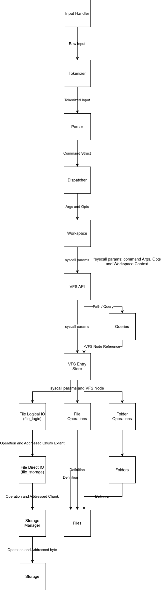

# **Virtual File System**

## **Table of Contents**
- [Introduction](#introduction)
- [System Overview](#system-overview)
- [Workspace Overview](#workspace-overview)
- [CLI Overview](#cli-overview)
- [Control Flow](#control-flow)
- [Tradeoffs](#tradeoffs)
- [Limitations](#limitations)
- [Build And Quick Start](#build-and-quick-start)

## **Introduction**
This is a file system abstraction layer with extent-based allocation and IO over a chunk addressed heap allocated virtual disk.

The file system depends solely on a custom virtual storage interface, making it agnostic of the storage backend. In the current implementation, the virtual storage interface is implemented over an in-memory virtual disk.

## **System Overview**
This systems architecuter is layered and stateless. The Following Is a high-level characterisation of the systems layers.

### **Storage(Virtual Disk)**
The storage is a contiguous sequence of bytes in the heap.
It is of constant size throughout the systems runtime. There is no physical enforcement or indication of chunking at this layer.

### **Storage Management**
this layer serves as the only interface between the file system and the storage system. It exposes storage I/O and storage allocator primitives.

#### *Storage chunks*
A chunk is the smallest allocatable unit of storage. All storage chunks are of the same size. The functions exposed at this layer take chunk index arguments (the position of a chunk in the contiguous storage) as the only way to address specific regions. They then internally convert those chunks into actual storage addresses. This gives the illusion that the storage is physically chunked even though it is merely logically chunked.

#### *Storage Manager*
The storage manager, commonly refered to as *storage_man*, owns the storage meta data, such as the allocation status of each storage chunk.

Respect of allocation -the fact that an occupied chunk can't be allocated and a free chunk can't be accessed- is enforced in this layer.

### **Files**
Files are objects that own locations in storage. Files store meta data about their allocated storage locations in *chunk extents*. That is, they are allocated contigous sequences in storage which they then keep track of by storing the start location and amount of bytes in each sequence (see [File Meta Data Overhead](#file-metadata-overhead)). Each file belongs to a parent (see [Folders](#folders)).

The File I/O is split into the following two layers:

#### 1. File Storage
this layer is responsible for using the storage manager to perform allocation and I/O operations on a file. the functions exposed at this layer allow the caller to address storage using chunk extents, which allows them to address storage regions of arbitrary width. After which it enforces file ownership on the specified storage, only allowing a file to access the chunks it owns. Then it methodically calls the storage manager-which can only reason about single chunks- on each of the addressed chunks.

#### 2. File Logic 
This layer encapsulates all storage details. Its exposed functions do not require the caller to reason about allocation, storage locations, or the storage manager. The caller merely provides highlevel information about their desired operation, such as a data buffer if the caller wishes to perform a write operation.

Even when performing a positional read operation, the caller does not pass storage chunk info. Instead, the caller passes relative byte information that indicates the datas sudo-position within the file. This, most of the time, does not reflect the actual data's structer in storage.

### **System Hierarchy**
At this point, there is no way to operate on a file(and in turn operate on storage) without directly having the files address in memroy. This layer introduces a hierarchical ecosystem in which files and folders have unique identifiers by which they can be referenced.

#### *Folders*
A folder is an object with a parent folder(required) and a collection of sub files and sub folders (folders are self referential). The root is a special kind of folder that does not have a parents, it serves the purpose of being the origin of the file system. Folders function as a way to give a collection of files structure.

#### *VFSEntryStore*
The VFSEntryStore is a flat collection of file and folder memory locations. All the entries(files and folders) in the file system are stored here. When an entry is created a special allocator allocates it space in the VFSEntryStore. And when an entry is deleted, its position is freed for future use. The VFSEntryStore is not aware of the structure of the file system, it is only responsible for storing the entries regardless of how they may be structured. The files systems structure, instead, is given by the parent and child relations between the entries.

#### *Paths and Queries*
The aforementioned unqiue identifier for each entry is the entry path. In this system, local name collision is strictly forbidden. That is, no two entries under the same folder can have the same name. This makes it so that each entry has a globaly unqiue path(the sequence of an entries parents and its name). Queries use this property to retreave an entry using its identifier or path. It is possible, for example, to retrieve an entry under a certain folder using its name(local entry search by name). It is also possible to retrieve it by using its path(path resolution). If an entries parent is unknown, the system also implements a global entry search by name function(find), but this may return multiple entries(distinguished by path) as there is nothing that prevents global identifier collision(a classic design for most file systems).

Hence, the system heirarchy layer provides a way to store, structure and retreive entries of the file system.

## **Workspace Overview**
As we mentioned earlier, the core [system](#system-overview) is stateless. It has no concept of user specific context such as  the current working directory.
The *workspace* is not a part of the core system, rather it is a user facing stateful wrapper of the [system](#system-overview). It simplifies the [system](#system-overview)'s interface by using information stored in its context. It also encapsulates the internal representation of entries by only allowing entries to be addressed using their names or paths. This layer is intended as a more concise but less versitile interface to the core [system](#system-overview)(see . 

## **CLI Overview**
The CLI is implemented over the [workspace](#workspace-overview). It is broken down into a sequence of steps starting by reading the command from the terminal and ending by performing the correct [workspace](#workspace-overview) call and showing the correct output. The following is a high-level overview of this processes.

### **Input Handling**
The input handler is implemented on canonical mode. It uses the POSIX syscall read() to stream input from the terminal buffer. It has two internal modes; Multiline mode(EOF terminated reading, input is processed when user sends an EOF signal using CTRL + 'D') and Newline terminated mode(input is processed when user submits '\n').

### **Tokenisation**
Once the input is submitted the tokeniser tokenises it in place. It places null terminators in place of token delimiters and stores the address of the start of each token.

### **Command Parser**
The command parser parses tokenised input into command objects.

### **Command Dispatcher**
The command dispatcher accepts command objects and calls the appropriate [command executor](#command-execution) passing in the command arguments and options

### **Command Execution**
Command Executors accept command arguments and options, using the workspace interface to perform system operations. Each command executor also handles its commands output.

## **Control Flow**
The following is a diagram demonstrating the control flow of the entire system

## **Tradeoffs**
In designing this system, a lot of tradeoffs had to be resolved. The following are some of the tradeoffs:

### **File Metadata Overhead**
For a file to keep track of the storage regions it owns, it must represent them in memory in some way. The naive solution is for a file to store the position of each chunk it owns. This is problematic since if we make the chunk size small, say 8 bytes, then for each 8 bytes of usable storage we waste 8 bytes(usual long int size for 64 systems) on meta data. That is 50% wasted on metadata. If we try to lower the percentage of space used on metadata by making the chunk size larger, we risk losing space to fragmentation. 

The solution to this problem is to keep fragmentation low by making the chunk size small(8 bytes in this implementation), while not storing the position of each chunk owned by the file but rather representing contiguous sequences of chunks using [chunk extents](#files). For a given storage allocation(as part of a write operation for example), a file is likely to be allocated hundreds if not thousands of bytes, these bytes are guaranteed to be contiguous by the nature of our allocator, and all of these bytes can be represented by a single chunk extent(2 longs and a bool regardless of the size of the allocation). This way we avoid fragmentation by keeping chunk size small, while still avoiding proportionate file meta data growth. 

Note that this implementation is more wastefull than the naive one when allocating less than 3 chunks(24 bytes in this implementation) to a file, but such an allocation is unlikely, so on average our chunk extent implementation is way better. 

### **Stateful Vs Stateless**
Making the core [system](#system-overview) stateful would make it easier to interface, but would create hidden coupling and make it less deterministic. On the other hand making it stateless would make it harder to interact with, for example, most functions would required the explicit passing of their dependencies, as making them global would create state. This makes for huge parameter lists and a more nuanced interface.

We solve this problem by making the core system stateless by creating a stateful wrapper on it(see [workspace](#workspace-overview)). This way we get the determinism of statelessness(one can even bypass the wrapper and directly interfere with the system api if they want), while getting the ease of use that comes with statefulness by accessing the system through the wrapper. 

## **Limitations**
The following are some of the limitions of the system as currently implemented.

### **Sentinal Value Chunk Termination**
When performing IO operations on a file, we are not guaranteed to completely fill up all the chunks we use. This creates chunks that are partially filled with important data, and partially filled with uninitialised bytes. In this current implementation of system, the end of the useful data in a chunk is indicated by a sentinal byte. This is very sub optimal as it is not byte safe for arbitrary binary data. 

The correct implementation is to store the logical size of a file(current implementation only stores physical size), and then use it to always find the correct offset in the files last chunk. This does not only guarantees byte safety, but it also enables us to implement the system in a way that enforces compactness and hence uses storage more efficiently.

### **File and Folder Polymorphism**
In the current implementation of the system, files and folders are not stored in a unified polymorphic representation. This causes occasionaly duplication accross the domains of files and folders where the only thing that changes is the type. To combat this there is a temorary unified type, but since this is not how files and folders are stored, there are scenarios where this representation can not be used.

## **Build And Quick Start**

### **Build Requirements**
- gcc
- make
- POSIX Environment

### **Build  Instructions**

Clone the repository using:

`git clone https://github.com/Tortooga/virtual-file-system-c.git`

build by running the following command in the root directory of the repo:

`make app`

A directory called `bin` will be created and the  systems binary executable will be placed in there. Run the program using:

`./bin/app`

### **Quick Start**
Once you are in the sysem shell, run the command `help` to get the list of commands along with their synopsis. To get a more detailed explaination for a given command run `help [COMMAND]`.